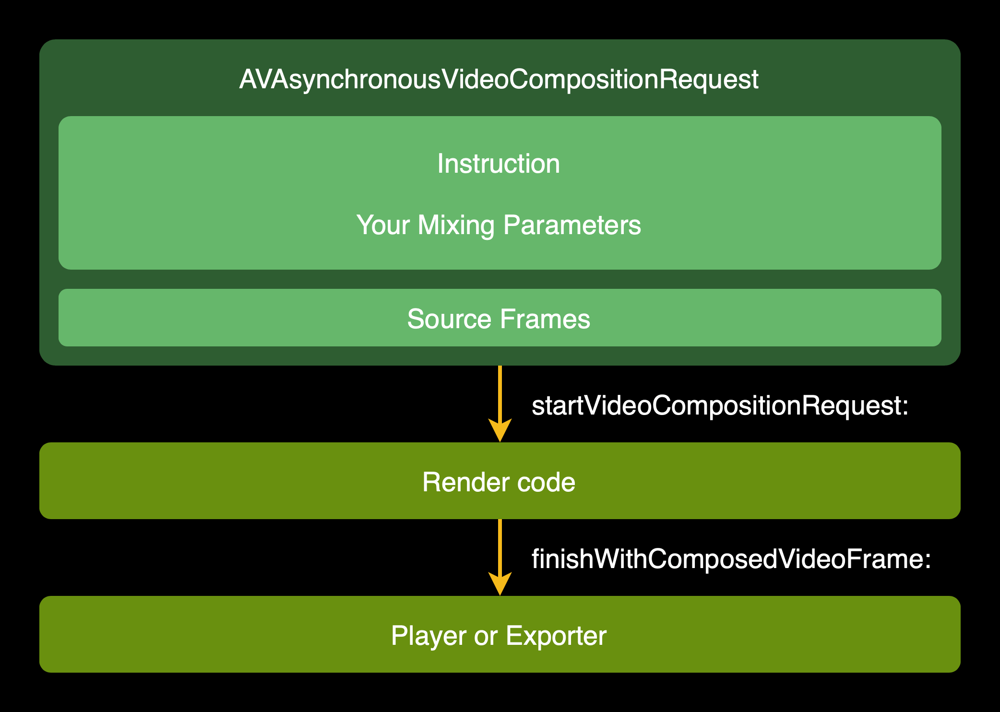

# VideoLab - High-performance and flexible video editing and effects framework

## What is VideoLab?

VideoLab is an open source, high-performance and flexible iOS video editing and effects framework that offers a more AE (Adobe After Effect) approach to use. The core of the framework is based on AVFoundation and Metal. Currently available features: 

* High-performance real-time video editing and exporting.
* Highly free combination of video, image, audio.
* Support audio pitch setting and volume adjustment.
* Support CALayer vector animations, so complex text animations are supported.
* Support keyframe animation.
* Support After Effect-like pre-compose.
* Support transitions.
* Support custom effects. Such as LUT filter, zoom blur, etc.

The following are some GIFs of features(multiple layers, text animation, keyframe animation, pre compose, and transition)

<p align="left">
    
    
    
    
    
</p>

Github repo: https://github.com/ruanjx/VideoLab

In this article, we will share the AVFoundation video editing workflow, and the design and implementation of the VideoLab framework.

## AVFoundation video editing workflow

Before we begin, it is recommended that those who are new to video editing watch the following WWDC video: 

* [Advanced Editing with AV Foundation](https://developer.apple.com/videos/play/wwdc2013/612/)
* [Edit and play back HDR video with AVFoundation](https://developer.apple.com/videos/play/wwdc2020/10009/)

Let's have a look at the overall workflow of AVFoundation video editing: 


Let's break down the steps:

1. Create one or more `AVAsset`.
2. Create `AVComposition`, `AVVideoComposition` and `AVAudioMix`. `AVComposition` specifies the temporal alignment of the source tracks. `AVVideoComposition` specifies geometry transformation and blending of tracks at any given time point, and `AVAudioMix` manages the mixing parameters of the audio tracks.
3. we can use these three objects to create `AVPlayerItem` and from it we can create an `AVPlayer` to play editing effects.
4. In addition, we can also use these three objects to create `AVAssetExportSession` to write the editing results to a file.

### AVComposition

Let's begin by looking at `AVComposition`, which is a collection of one or more `AVCompositionTrack` audio and video tracks. Where `AVCompositionTrack` can contain `AVAssetTrack` from multiple `AVAsset`.

In the following illustration, the audio/video `AVAssetTrack` from two `AVAssets` are combined into the audio/video `AVCompositionTrack` of `AVComposition`.


### AVVideoComposition

Imagine the scene shown below, where `AVComposition` contains two `AVCompositionTrack`. We need to blend the images of both `AVCompositionTrack` at time point T1. To do this, we need to use `AVVideoComposition`.


`AVVideoComposition` can be used to specify the render size and render scaling, as well as the frame rate. In addition, an array of Instructions implementing the `AVVideoCompositionInstructionProtocol` protocol is stored, and these Instructions store blending parameters. With these blending parameters, `AVVideoComposition` can blend the corresponding image frames with a Compositor that implements the `AVVideoCompositing` protocol.

The overall workflow is shown in the following illustration:


Let's focus on Compositor, where we have multiple original frames that need to be processed and a new one output. The workflow is shown in the following diagram:



The flow can be broken down as follows:

1. `AVAsynchronousVideoCompositionRequest` binds a series of original frames for current time, and the Instruction where the current time is located.
2. The `startVideoCompositionRequest:` callback is received, and the Request is taken.
3. Render the composite frame based on the original frame and the instruction-related blending parameters.
4. Call `finishWithComposedVideoFrame:` to deliver the rendered frame.

### AVAudioMix

Using `AVAudioMix`, you can process audio on the audio track of `AVComposition`. `AVAudioMix` contains a set of `AVAudioMixInputParameters`, each `AVAudioMixInputParameters` corresponds to an audio `AVCompositionTrack`. This is shown in the following illustration: 


`AVAudioMixInputParameters` contains an `MTAudioProcessingTap` that you can use to process audio in real time. Of course, for linear volume changes you can directly use the volume ramp interface `setVolumeRampFromStartVolume:toEndVolume:timeRange:`

In addition, `AVAudioMixInputParameters` also contains an `AVAudioTimePitchAlgorithm` that you can use to set the pitch.

## Design of the framework

We introduced the AVFoundation video editing process before, and now we will introduce the design of the VideoLab framework.

First, let's briefly introduce AE (Adobe After Effect), a motion graphics and visual effects software commonly used by special effects designers (see the [AE website](https://www.adobe.com/cn/products/aftereffects.html) for more information). AE controls the compositing of video, audio, and still images through "layers", and each media (video, audio, and still image) object has its own separate track.

The following illustration is an example of compositing two videos in AE.


Let's break down this illustration: 

* Within the Project area, there is a composition named Comp1 of type Composition. A composition can be considered a creation in AE and can be played back and exported as a video. A composition can set parameters such as resolution, frame rate, background color, etc.
* Within the Timeline Control area, there are two layers with sources video1.MOV and video2.MOV. We can freely set the layer parameters, such as Transform (the example also has keyframe animation for Scale), Audio, and also freely move the layer in the right area. In addition, we can add a set of effects to each layer.

基于对 AE 的分析，我们可以设计相似的描述方式：


* `RenderComposition`，对应 AE 中的合成（Composition）。包含一组 `RenderLayer`（对应 AE 中的层）。此外，`RenderComposition` 还包含 `BackgroundColor`、`FrameDuration`、`RenderSize`，分别对应背景色、帧率及渲染大小等剪辑相关参数。
* `RenderLayer`，对应 AE 中的层（Layer）。包含了 `Source`、`TimeRange`、`Transform`、`AudioConfiguration`、`Operations`，分别对应素材来源、在时间轴的时间区间、变换（位置、旋转、缩放）、音频配置及特效操作组。 
* `RenderLayerGroup`，对应 AE 的预合成。`RenderLayerGroup` 继承自 `RenderLayer`，包含一组 `RenderLayer`。
* `KeyframeAnimation`，对应 AE 的关键帧动画。包含了 `KeyPath`、`Values`、`KeyTimes`、`TimingFunctions`，分别对应关键路径、数值数组、关键时间数组、缓动函数数组。

以上介绍了 `RenderComposition`、`RenderLayer`、`RenderLayerGroup` 以及 `KeyframeAnimation`。从前面的 AVFoundation 介绍可知，我们需要生成 `AVPlayerItem` 与 `AVAssetExportSession` 用于播放与导出。因此，我们需要有一个对象可以解析这几个描述对象，并用 AVFoundation 的方法生成 `AVPlayerItem` 与 `AVAssetExportSession`。框架将这个对象命名为 `VideoLab`，可以理解成这是一个实验室。

整体的工作流程如下：


我们来拆解下步骤：

1. 创建一个或多个 `RenderLayer`。
2. 创建 `RenderComposition`，设置其 `BackgroundColor`、`FrameDuration`、`RenderSize`，以及 `RenderLayer` 数组。
3. 使用创建的 `RenderComposition` 创建 `VideoLab`。
4. 使用创建的 `VideoLab` 生成 `AVPlayerItem` 或 `AVAssetExportSession`。

这个章节主要介绍了框架的设计思路。设计思路总的来说，希望框架是类 AE 化灵活的方式设计。

## 框架的实现

### Source

从前面的介绍，我们知道一个 `RenderLayer` 可能包含一个素材来源。素材来源可以是视频、音频及静态图片等。框架抽象了 `Source` 协议，以下是 `Source` 协议的核心代码：

```swift
public protocol Source {
    var selectedTimeRange: CMTimeRange { get set }
    
    func tracks(for type: AVMediaType) -> [AVAssetTrack]
    func texture(at time: CMTime) -> Texture?
}
```

* `selectedTimeRange` 是素材本身的选择时间区间，如一段长 2 分钟的视频，我们选择 60s-70s 的区间作为编辑素材，那么 `selectedTimeRange` 就是 [60s-70s)（实际代码使用 `CMTime`）。
* `tracks(for:)` 方法，用于根据 `AVMediaType` 获取 `AVAssetTrack`。
* `texture(at:)` 方法，用于根据时间获取 `Texture`（纹理）。

框架提供了 4 种内置的源，分别为：1. `AVAssetSource`，`AVAsset`；2. `ImageSource`，静态图片；3. `PHAssetVideoSource`，相册视频；4. `PHAssetImageSource`，相册图片。我们也可以实现 `Source` 协议，提供自定义的素材来源。

### AVComposition

到目前为止我们已经知道了 `RenderComposition`、`RenderLayer`、`RenderLayerGroup`、`KeyframeAnimation`、`Source`，接下来将介绍 `VideoLab` 类如何利用这些对象创建 `AVComposition`、`AVVideoComposition` 以及 `AVAudioMix`。

让我们先来看下 `AVComposition`，我们需要给 `AVComposition` 分别添加视频轨道与音频轨道。

让我们结合一个示例来说明这个过程，如下图所示，这个 `RenderComposition` 有 RenderLayer1（包含视频/音频）、RenderLayer2(仅视频）、RenderLayer3（图片）、RenderLayer4（仅特效操作组）以及一个 `RenderLayerGroup`（包含 RenderLayer5、RenderLayer6，均包含视频/音频）。


让我们先聊下添加视频轨道，添加视频轨道包含以下步骤：

**1. 将 RenderLayer 转换为 VideoRenderLayer**

`VideoRenderLayer` 是框架内部对象，包含一个 `RenderLayer`，主要负责将 `RenderLayer` 的视频轨道添加到 `AVComposition` 中。可转换为 `VideoRenderLayer` 的 `RenderLayer` 包含以下几类：1. `Source` 包含视频轨道；2. `Source` 为图片类型；3. 特效操作组不为空（`Operations`）。

`VideoRenderLayerGroup` 是 `RenderLayerGroup` 对应视频的框架内部对象，包含一个 `RenderLayerGroup`。可转换为 `VideoRenderLayerGroup` 的 `RenderLayerGroup` 只需满足一个条件：包含的 `RenderLayer` 组有一个可以转化为 `VideoRenderLayer`。

转换 `VideoRenderLayer` 之后如下图所示：


**2. 将 VideoRenderLayer 视频轨道添加到 AVComposition 中**

对于 `RenderLayer` 的 `Source` 包含视频轨道的 `VideoRenderLayer`，从 `Source` 中获取视频 `AVAssetTrack`，添加到 `AVComposition`。

对于 `RenderLayer` 的 `Source` 为图片类型或仅有特效操作组类型（`Source` 为空）的 `VideoRenderLayer`，使用空视频添加一个新的视频轨道（这里的空视频是指视频轨道是黑帧且不包含音频轨道的视频）

添加完之后 `AVComposition` 的视频轨道如下图所示：


如图所示，VideoRenderLayer1 与 VideoRenderLayer5 共用了一个视频轨道。这是由于苹果对视频轨道数量有限制，我们需要尽量的重用视频轨道（每条视频轨道对应一个解码器，当解码器数量超出系统限制时，会出现无法解码的错误）。

框架视频轨道重用的原则是，**如果要放入的 VideoRenderLayer 与之前视频轨道的 VideoRenderLayer 在时间上没有交集，则可以重用这个视频轨道，所有视频轨道都重用不了则新增一个视频轨道。**

让我们接着聊下添加音频轨道，添加音频轨道包含以下步骤：

**1. 将 RenderLayer 转换为 AudioRenderLayer**

`AudioRenderLayer` 是框架内部对象，包含一个 `RenderLayer`，主要负责将 `RenderLayer` 的音频轨道添加到 `AVComposition` 中。可转换为 `AudioRenderLayer` 的 `RenderLayer` 只需满足一个条件：`Source` 包含音频轨道。

`AudioRenderLayerGroup` 是 `RenderLayerGroup` 对应音频的框架内部对象，包含一个 `RenderLayerGroup`。可转换为 `AudioRenderLayerGroup` 的 `RenderLayerGroup` 只需满足一个条件：包含的 `RenderLayer` 组有一个可以转化为 `AudioRenderLayer`。

转换 `AudioRenderLayer` 之后如下图所示：


**2. 将 AudioRenderLayer 音频轨道添加到 AVComposition 中**

对于 `RenderLayer` 的 `Source` 包含音频轨道的 AudioRenderLayer，从 `Source` 中获取音频 AVAssetTrack，添加到 AVComposition。

添加完之后 `AVComposition` 的音频轨道如下图所示：


如图所示，不同于视频轨道的重用，音频的每个 `AudioRenderLayer` 都对应一个音频轨道。这是由于一个 `AVAudioMixInputParameters` 与一个音频的轨道一一对应，而其音高设置（`audioTimePitchAlgorithm`）作用于整个音频轨道。如果重用的话，会存在一个音频轨道有多个 `AudioRenderLayer` 的情况，这样会导致所有的 `AudioRenderLayer` 都要配置同样的音高，这显然是不合理的。。

### AVVideoComposition

从前面的 AVFoundation 介绍可知，`AVVideoComposition` 可以用来指定渲染大小和渲染缩放，以及帧率。此外，还有一组存储了混合参数的 Instruction（指令）。有了这些混合参数之后，`AVVideoComposition` 可以通过自定义 Compositor（混合器） 来混合对应的图像帧。

这个章节将主要介绍如何生成这组 Instruction（指令），以及创建 `AVVideoComposition`。我们将使用上个章节生成的 `VideoRenderLayer`，生成这组 Instruction（指令）。

让我们结合一个简单示例来说明这个过程，如下图所示，这个 `AVComposition` 有 VideoRenderLayer1、VideoRenderLayer2、VideoRenderLayer3 三个 `VideoRenderLayer`。转换过程包含以下步骤：

* 在时间轴上记录每个 `VideoRenderLayer` 的起始时间点与结束时间点（如下图 T1-T6）。
* 为每个时间间隔创建一个 Instruction，与时间间隔有交集的 `VideoRenderLayer`，都作为 Instruction 的混合参数（如下图 Instruction1-Instruction5）。


接着我们创建 `AVVideoComposition`，并设置帧率、渲染大小、Instruction 组以及自定义的 Compositor。核心代码如下：

```swift
let videoComposition = AVMutableVideoComposition()
videoComposition.frameDuration = renderComposition.frameDuration
videoComposition.renderSize = renderComposition.renderSize
videoComposition.instructions = instructions
videoComposition.customVideoCompositorClass = VideoCompositor.self
```

到目前为止，我们已经有了渲染所需的 Instruction 组与混合参数，我们继续介绍如何利用它们在 Compositor 中绘制帧画面。我们对前面的 Compositor 工作流程做一个更新，将混合参数更新为与 Instruction 有交集的 `VideoRenderLayer` 组。


我们同样以一个示例来说明视频混合的规则，如下图所示，在 T1 时间点，我们想要混合这几个 `VideoRenderLayer` 的画面。


我们的渲染混合规则如下：

* 排序 `VideoRenderLayer` 组，依据其所包含的 `RenderLayer` 的 `layerLevel`。如上图所示在纵向从高到低的排序。
* 遍历 `VideoRenderLayer` 组，对每个 `VideoRenderLayer` 分为以下三种混合方式：
    * 当前 `VideoRenderLayer` 是 `VideoRenderLayerGroup`，即为预合成方式。遍历处理完自己内部的 `VideoRenderLayer` 组，生成一张纹理，混合到前面的纹理。
    * 当前 `VideoRenderLayer` 的 `Source` 包含视频轨道或 `Source` 为图片类型，拿到纹理处理自己的特效操作组（Operations），接着混合到前面的纹理。
    * 当前 `VideoRenderLayer` 仅特效操作组，所有的操作作用于前面混合的纹理。

渲染混合规则总结来说，**按层级渲染，从下往上。如当前层级有纹理则先处理自己的纹理，再混合进前面的纹理。如当前层级没有纹理，则操作直接作用于前面的纹理。**

让我们将规则用在上图的示例中，假设我们最后输出的纹理为 Output Texture：

1. 处理最底层的 VideoRenderLayerGroup 生成 Texture1，将 Texture1 混合进 Output Texture。
2. 处理 VideoRenderLayer2 生成 Texture 2，将 Texture2 混合进 Output Texture。
3. 处理 VideoRenderLayer3 生成 Texture 3，将 Texture3 混合进 Output Texture。
4. 处理 VideoRenderLayer4 的特效操作组，作用于 Output Texture。

### AVAudioMix

从前面的 AVFoundation 介绍可知，`AVAudioMix` 用于处理音频。`AVAudioMix` 包含一组的 `AVAudioMixInputParameters`，可以设置 `MTAudioProcessingTap` 实时处理音频，设置 `AVAudioTimePitchAlgorithm` 指定音高算法。

这个章节将主要介绍如何生成这组 `AVAudioMixInputParameters`，以及创建 `AVAudioMix`。我们将使用 AVComposition 章节生成的 `AudioRenderLayer`，生成这组 `AVAudioMixInputParameters`。

让我们结合一个简单示例来说明这个过程，如下图所示，这个 `AVComposition` 有 AudioRenderLayer1、AudioRenderLayer2、AudioRenderLayer3 三个 `AudioRenderLayer`。转换过程包含以下步骤：

* 为每个 `AudioRenderLayer` 创建了一个 `AVAudioMixInputParameters`
* 为每个 `AVAudioMixInputParameters` 设置一个 `MTAudioProcessingTap`。`MTAudioProcessingTap` 用于实时处理音频，从 `RenderLayer` 的 `AudioConfiguration` 获取音频配置，实时计算当前时间点的音量。
* 为每个 `AVAudioMixInputParameters` 设置 `AVAudioTimePitchAlgorithm`。`AVAudioTimePitchAlgorithm` 用于设置音高算法，从 `RenderLayer` 的 `AudioConfiguration` 获取音高算法配置。


接着我们创建 `AVAudioMix`，并设置 `AVAudioMixInputParameters` 组。代码如下：

```swift
let audioMix = AVMutableAudioMix()
audioMix.inputParameters = inputParameters
```

以上几个章节从大的维度介绍了框架的实现，对于 Metal 部分的介绍，后续会考虑再起一篇文章介绍。接下来的几个章节，介绍下框架的后续计划、开发框架过程逆向其他应用的一些分享以及推荐的学习资料。

## 后续计划

* 支持 Open GL 渲染（使用方决定渲染引擎使用 Metal 或 Open GL）。
* 特性持续补充，如变速、更便捷的转场使用方式（可能是提供 TransitionLayer）等。
* 提供界面交互的 Demo。

## 逆向分享

笔者在开发框架过程中，逆向了国内外一众视频编辑器。在比较各自的方案之后，选用了 AVFoundation 加 Metal 的方案作为框架核心。这里简要分享下逆向 Videoleap 的一些亮点：

* 尽量少的 Draw Call，尽量将一个层的操作都放在一个 Shader 脚本中（如 Videoleap 中对一个视频片段的 YUV 转 RGB、滤镜、变换等都在一个 Shader 内）。
* 使用 IOSurface 生成纹理性能更优（需要系统大于等于 iOS 11）。
    * Metal 对应方法 `makeTexture(descriptor:iosurface:plane:)`
    * Open GL 对应方法 `texImageIOSurface(_:target:internalFormat:width:height:format:type:plane:)`
* 尽量多的使用 Framebuffer Fetch（如果 fragment 只是像素点本身的颜色变化可以使用，如果有参考临近像素点则无法使用）
    * [Metal 参考资料](https://stackoverflow.com/questions/40968576/read-framebuffer-in-metal-shader)，框架中的 Metal 脚本对应的 [[color(0)]]
    * [Open GL 参考资料](https://developer.apple.com/library/archive/documentation/3DDrawing/Conceptual/OpenGLES_ProgrammingGuide/BestPracticesforShaders/BestPracticesforShaders.html#//apple_ref/doc/uid/TP40008793-CH7-SW23#Fetch%20Framebuffer%20Data%20for%20Programmable%20Blending)，搜索 GL_EXT_shader_framebuffer_fetch

## 推荐资料

### AVFoundation

* [WWDC 2012 - Real-Time Media Effects and Processing during Playback](https://developer.apple.com/videos/play/wwdc2012/517/)
* [WWDC 2013 - Advanced Editing with AV Foundation](https://developer.apple.com/videos/play/wwdc2013/612/)
* [WWDC 2020 - Edit and play back HDR video with AVFoundation](https://developer.apple.com/videos/play/wwdc2020/10009/)
* [AVFoundation Programming Guide](https://developer.apple.com/library/archive/documentation/AudioVideo/Conceptual/AVFoundationPG/Articles/00_Introduction.html)
* [Apple AVFoundation Collection](https://developer.apple.com/av-foundation/)
* [Apple Sample Code - AVCustomEdit](https://developer.apple.com/library/archive/samplecode/AVCustomEdit/Listings/AVCustomEdit_APLCustomVideoCompositor_m.html#//apple_ref/doc/uid/DTS40013411-AVCustomEdit_APLCustomVideoCompositor_m-DontLinkElementID_10)
* [Github - Cabbage](https://github.com/VideoFlint/Cabbage)

### 渲染

* [Learn OpenGL - Getting started](https://learnopengl.com/Introduction)
* [Apple Metal Collection](https://developer.apple.com/metal/)
* [Metal Best Practices Guide](https://developer.apple.com/library/archive/documentation/3DDrawing/Conceptual/MTLBestPracticesGuide/index.html#//apple_ref/doc/uid/TP40016642-CH27-SW1)
* [Metal by Tutorials](https://www.raywenderlich.com/books/metal-by-tutorials/v2.0)
* [Metal by Example](https://metalbyexample.com/category/advanced/)
* [小专栏 - iOS 图像处理](https://xiaozhuanlan.com/u/4926220611)
* [Github - GPUImage3](https://github.com/BradLarson/GPUImage3)

## 作者

* 阮景雄，目前就职于 RingCentral，前美拍 iOS 负责人
* 邮件：ruanjingxiong@gmail.com


